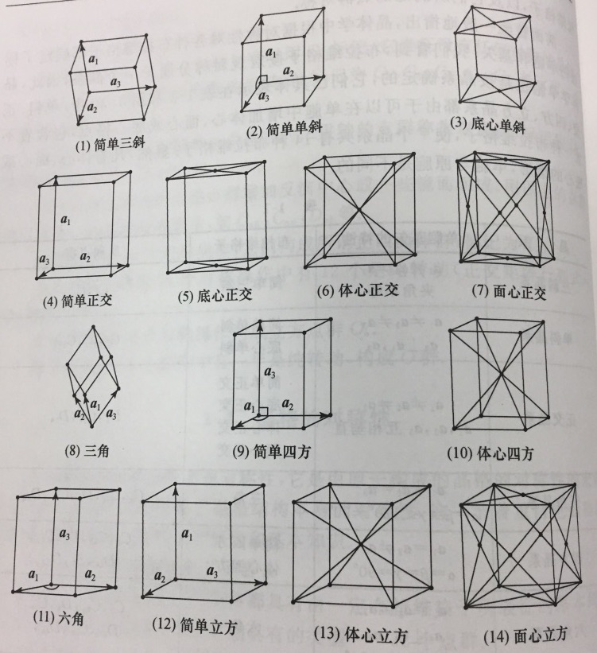
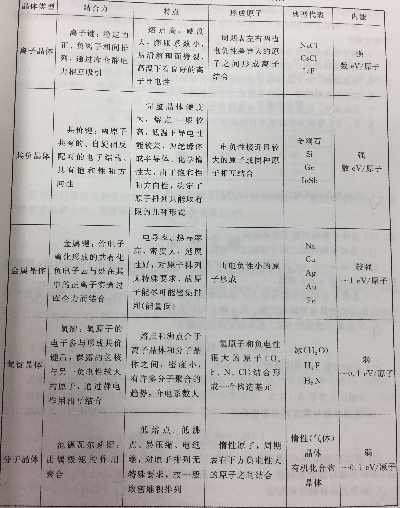

# 固体物理基础24小时预习大冒险

## 第一章 晶体结构

> 根据**组成粒子空间位置的区别，
> 即物质结构上的差别**，
> 通常将固态材料分为晶体、准晶体和非晶体三大类。

> 晶体的结构特点是组成粒子在空间的排列具有周期性，
> 表现为既有**长程取向有序**，又有**平移对称性**。

### 1 空间点阵学说（布拉菲格子）

#### 七大晶系

|晶系|单胞基失的特性|布拉菲格子|所属点群|
|:---:|:---:|:---:|:---:|
|三斜晶系|$\boldsymbol{a}_1 \ne \boldsymbol{a}_2 \ne \boldsymbol{a}_3$   夹角不等 |简单三斜 $P$ | $C_1, C_i$ |
|单斜晶系|$\boldsymbol{a}_1 \ne \boldsymbol{a}_2 \ne \boldsymbol{a}_3$   $\boldsymbol{a}_2 \perp \boldsymbol{a}_1, \boldsymbol{a}_3$|简单单斜 底心单斜|$C_2,C_s,C_{2h}$|

#### 14种布拉菲格子

## 第二章 晶体的结合

## 第三章 晶格振动

> 在常温下晶体中原子热运动的幅度和原子间距相比是很小的，
> 称晶体原子的这种微振动为**晶格振动**。

> 原子的运动状态会在晶体中以波的形式传播，
> 形成“**格波**”。

### 一维单原子晶格的振动

第 $n$ 个原子的运动方程为
$$
m\frac{\mathrm{d}^2(na+U_n)}{\mathrm{d}t^2}
=
m{{\mathrm{d}^2U_n} \over {\mathrm{d}t^2}}
=
f_{n-1} + f_{n+1}
=
\beta(U_{n+1}+U_{n-1}-2U_n)
$$
$n$ 总共可取 $N$ 个值，该式实为 $N$ 个方程组成的方程组，
可用 $N$ 个解，晶体的总自由度为 $N$。

当 $a$ 非常小时，一维原子链可看做一个连续长杆，
$$
\left\{
    \begin{array}{c}
        na \to x \\
        a \to \Delta{}x
    \end{array}
\right. \\
U_n(t) = U(na,t) \to U(x,t)
$$

上式可化简为

$$
\frac{\mathrm{d}^2U(x,t)}{\mathrm{d}t^2}
=
\upsilon_0^2\frac{\mathrm{d}^2U(x,t)}{\mathrm{d}x^2}
$$

试探解：
$$
U_n(t) = A\mathrm{e}^{i(qna-\omega{}t)}
$$
$q = 2\pi/\lambda$ 是波矢。
上式表示了一个简谐运动，
也代表了一种全部原子都以同一频率 $\omega$，
同一振幅 $A$，相邻两原子振动相位差均为 $qa$ 的集体运动模式。
这是一个简谐行波，称他为一个**格波**。

> 一个格波是晶体中全体原子都参与的一种简单的集体运动形式。

格波的相速度 $v_p = \frac{\omega}{q}$.

> 一个格波表示的是所有原子同时做频率为 $\omega$ 的振动。

格波波长 $\lambda = \frac{2\pi}{q}$，波矢 $\vec{q} = \frac{2\pi}{\lambda}\vec{n}$，相位差 $(n'-n)qa$.

格波的取值：
$$
-\frac{\pi}{a} < q \le \frac{\pi}{a} \qquad \text{-- 第一布里渊区}
$$
